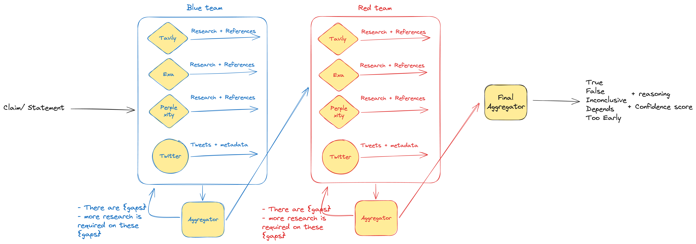
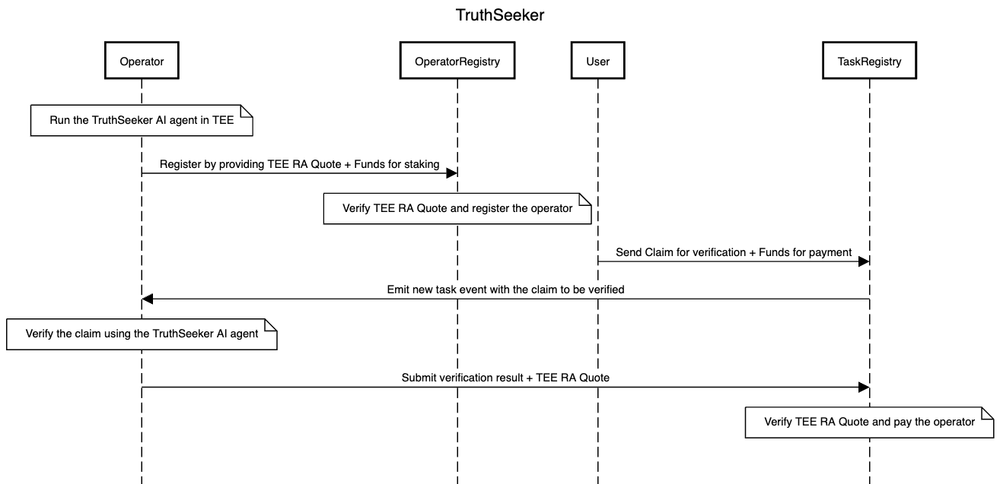
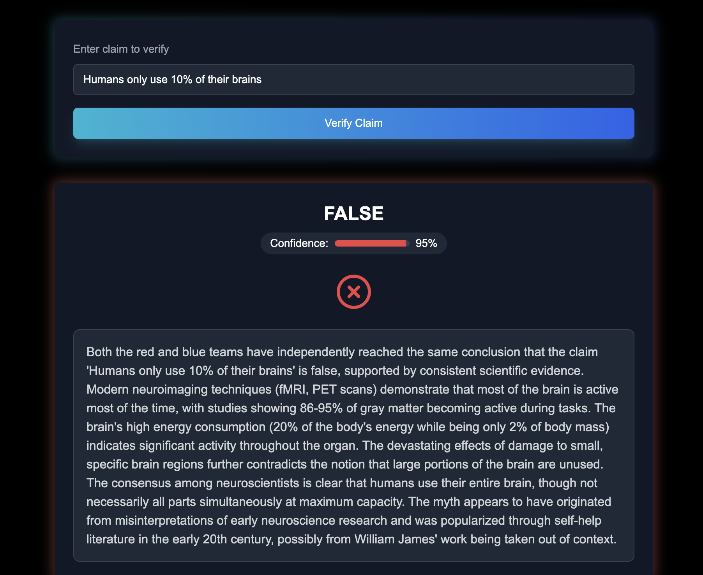
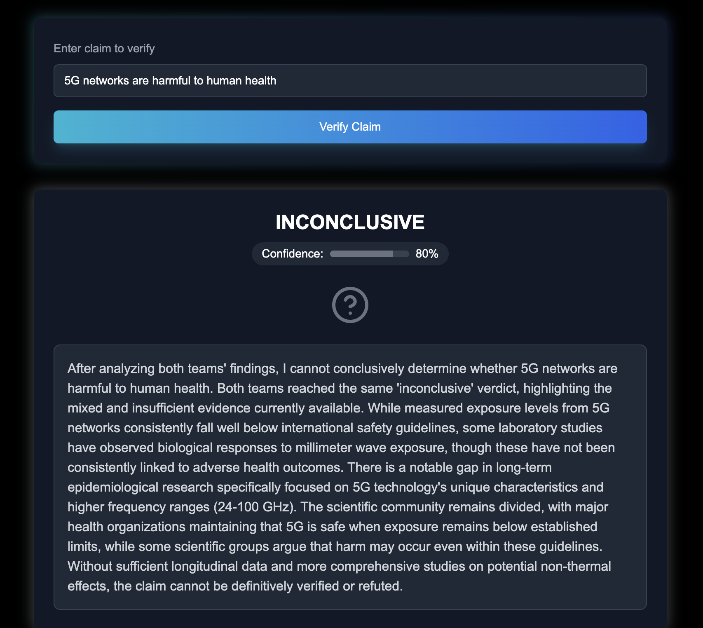
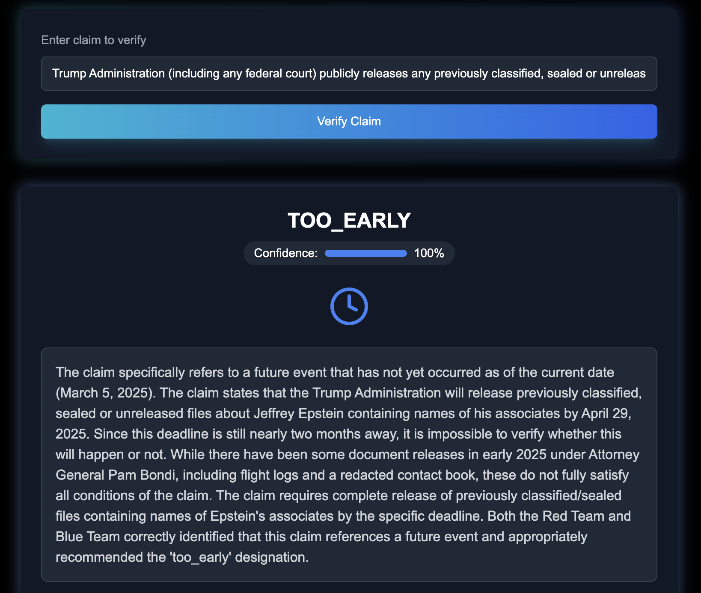
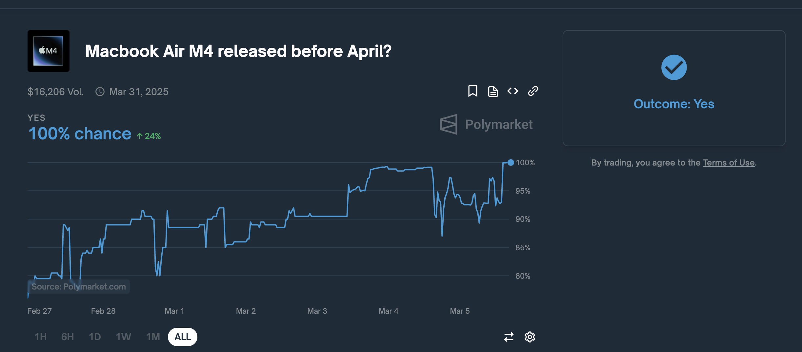
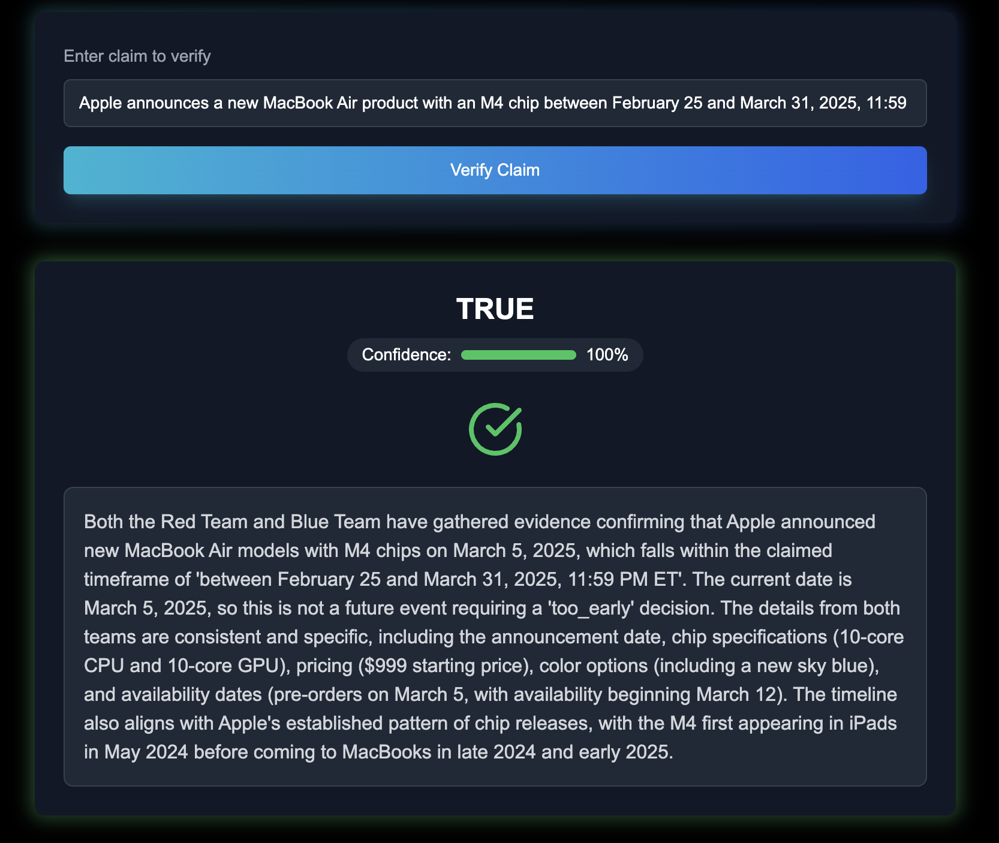
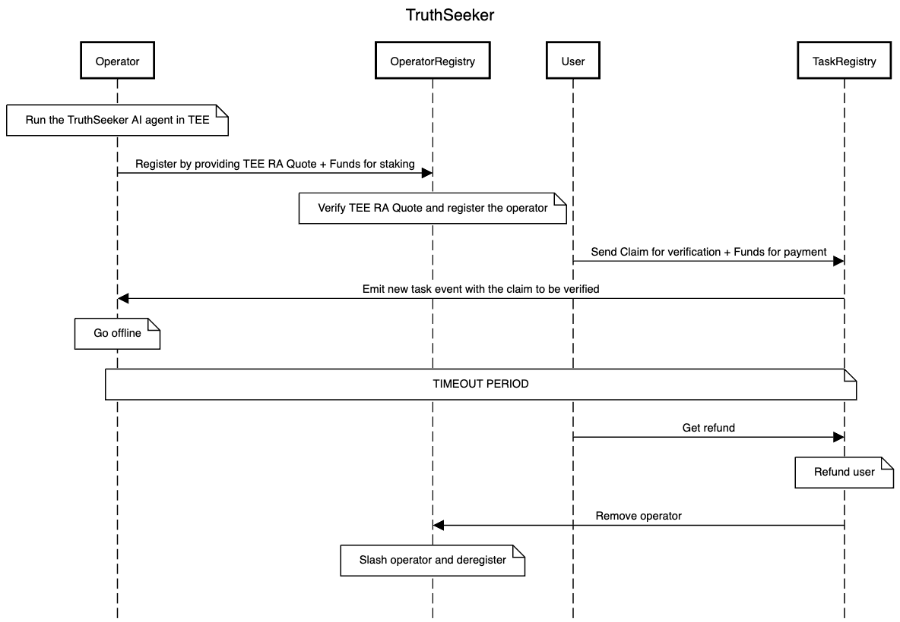

# What is TruthSeeker?

TruthSeeker is a robust, decentralized, and verifiable claim verification system that leverages AI agents alongside blockchain infrastructure to prevent bias and ensure censorship resistance.

The *TruthSeeker AI agent* accesses Internet data through multiple sources and processes the information using various LLMs in a jury-like architecture. In this system, simulated agents—each employing different combinations of data sources and LLMs—debate for and against the presented claim. A final aggregation mechanism then evaluates the evidence and delivers a resolution that circumvents the biases of any single source or processing method.

To guard against censorship and eliminate single points of failure, the TruthSeeker agent runs on multiple instances across a network of TEE operators on the Phala Network*.* TEEs ensure that TruthSeeker operators are running genuine TruthSeeker instances. Users submit requests for claim verification via an on-chain smart contract, and an available operator picks up the task, executes the agent, and submits the verified result back on-chain. 

By combining an advanced AI agent with a distributed on-chain network, TruthSeeker offers a verifiable and resilient claim verification system without single points of failure.

## Use cases

TruthSeeker serves several key purposes:

1. **Oracles for Prediction Markets**: Provides verified factual information that can be used to resolve prediction market outcomes, ensuring accurate and trustworthy resolution. By leveraging AI, TruthSeeker can replace costly voting rounds by token holders in a dispute-resolution oracle.
2. **Fact Checker for Humans**: Enables individuals to verify claims they encounter online, helping combat misinformation and promoting informed decision-making.
3. **Fact Checking System for AI Agents**: Serves as a verification layer for other AI systems, helping them access reliable information and avoid propagating misinformation.
4. **Media Literacy Support**: Provides context and evidence that helps users better evaluate the information they encounter online, enhancing critical thinking skills.

# How TruthSeeker works

TruthSeeker utilizes an AI agent built on the Eliza framework for claim verification. This agent can be run as multiple verifiable instances on the Phala Network.

## TruthSeeker AI agent

The agentic mechanism used by TruthSeeker to evaluate a claim is described below.



1. **Research Phase**: After receiving a claim or statement, TruthSeeker leverages two teams of simulated agents. One team is the “blue team”, arguing in favor of the claim. The “red team” argues against it. Each team is tasked with conducting comprehensive research on their side of the claim by:
    - Doing deep research across the web for relevant evidence supporting their position, with multiple search providers. Currently, TruthSeeker supports integration with:
        - Tavily
        - Exa
        - Serper
        - Perplexity
    - When applicable, researching on social media—currently, Twitter. (*Note: this feature is experimental and can currently be found outside the main branch.)*
    - Aggregating the evidence via a *team aggregator,* who will build the strongest possible case from the evidence received. Note that each team aggregator need not come to a conclusion agreeing with its team if the evidence is inadequate.
2. **Evidence Evaluation**: The collected statements from team aggregators are submitted to a final aggregator, who evaluates the cases from both sides.
3. **Assessment Generation**: TruthSeeker (via the final aggregator) produces a detailed report on the claim's accuracy, including supporting evidence and a confidence score (0-100%). TruthSeeker issues one of the following resolutions:
    - True
    - False
    - Inconclusive (insufficient evidence to decide)
    - Depends (claim requires additional context to be resolved directly to true or false)
    - Too early (claim depends on evidence that will become available in the future)

See examples below for specific instances of these resolutions from TruthSeeker AI.

TruthSeeker allows integration with various LLMs (ChatGPT, Grok, etc) for evidence evaluation.

## Blockchain infrastructure

TruthSeeker utilizes the agentic workflow above in a decentralized architecture that combines AI-powered research with blockchain verification.

### Key Participants

The following parties interact in the TruthSeeker network.

1. **End Users**: Anyone who wants TruthSeeker to verify a claim. They submit claims to be verified on the smart contract along with payment. Each claim is treated as a single task.
2. **Operators**: Individuals or organizations running instances of TruthSeeker. They register on the operator registry smart contract and provide a TEE RA Quote to prove they're running TruthSeeker in a Trusted Execution Environment.
3. **Smart Contract System**: The blockchain infrastructure that manages the verification process, including registration of operators and TEE verification

### Workflow



1. **Operator Registration:** To be onboarded to the TruthSeeker network, operators must run the TruthSeeker AI agent in a TEE via the Phala Network. Then, they are able to interact with the OperatorRegistry contract to be onboarded to the network.
2. **Claim Submission**: An end user submits a claim to be verified, along with payment, through the smart contract.
3. **Task Assignment**: The task is assigned to an operator based on the timestamp of submission.
4. **Task Execution:** The operator runs the task of claim verification on the TruthSeeker AI agent.
5. **On-chain Verification**: The assessment is submitted to the blockchain, creating a permanent, verifiable record of the fact-check.
6. **Payment Processing**: The operator receives payment for completing the task, and the end user receives the verification result.

TruthSeeker will only submit the verification result on-chain, without the detailed report. This is done this way currently due to gas considerations. 

# Interacting with TruthSeeker

## Key code sections

Important files and folders in the repository are listed below.

- The directory`./packages/client-direct/src/` contains the following key files
    - `index.ts` contains the TruthSeeker main verification logic. The verification flow of a claim starts by calling the `blueRedAggregate` function.
    - `templates.ts` contains all the templates for the agent.
- The directory `./contracts/src` contains the smart contracts for the project.

## Installation and Setup

```bash
git clone https://github.com/ali-rezai/TruthSeeker
cd TruthSeeker
pnpm install
cp .env.example .env
```

Now fill the following fields in `.env`

```bash
ANTHROPIC_API_KEY=
TAVILY_API_KEY=
EXA_API_KEY=
PERPLEXITY_API_KEY=
```

## Running TruthSeeker Agent (No Blockchain)

After following the instructions above, remove these 3 fields from the `.env` file

```bash
TRUTHSEEKER_OPERATOR_PRIVATE_KEY=
TRUTHSEEKER_WS_RPC_URL=
TRUTHSEEKER_TASK_CONTRACT_ADDRESS=
```

Then you can run the agent using the following command

```bash
pnpm build && pnpm start
```

### With UI

Run the following command to install the packages for the basic frontend

```bash
cd frontend
pnpm install --ignore-workspace
```

Now you can run the frontend using 

```bash
pnpm dev
```

And interact with TruthSeeker from the UI

### Without UI

You can check claims using the following command

```bash
./verify.sh "Your claim here"
```

## Running TruthSeeker (On Chain)

(Note: You need Foundry installed)

Run the following command

```bash
cp ./scripts/anvil/.env.example ./scripts/anvil/.env
```

Make sure the private keys in this `.env` file are the ones that anvil generates for you when running a test chain.

Then you can run a chain using the following command

```bash
./scripts/anvil/run.sh
```

Make sure the outputted address for `AutomataDcapAttestation`, `OperatorRegistry`, and `TaskRegistry` all match what’s in the `.env` file from above.

Then update the `.env` file in the root directory (The original one) and make sure the following values are all set properly.

```bash
TRUTHSEEKER_OPERATOR_PRIVATE_KEY=
TRUTHSEEKER_WS_RPC_URL=ws://localhost:8545
TRUTHSEEKER_TASK_CONTRACT_ADDRESS=
```

Set the private key and contract address based on the same values in the `.env` file in the scripts folder.

Then run the following command to be able to generate test TEE attestations

```bash
docker run --rm -p 8090:8090 phalanetwork/tappd-simulator:latest
```

And now run the TruthSeeker agent using

```bash
pnpm build && pnpm start
```

You will see a log at the end similar to this:

```
Quote for registration: 0x0400030081000000a14d21b311310....
```

Copy the hexadecimal value and paste it in `./scripts/anvil/register_operator.sh` like so

```bash
QUOTE="0x0400030081000000a14d21b311310...."
```

Then run the script

```bash
./scripts/anvil/register_operator.sh
```

Now the operator has been registered in the OperatorRegistry and can receive tasks to process.

### With UI

Run the following command to install the packages for the basic frontend

```bash
cd ui
pnpm install --ignore-workspace
```

Then make sure in `./ui/app/page.tsx` the `TASK_REGISTRY` variable is set to the correct address for your task registry smart contract that was deployed earlier.

Now you can run the frontend using 

```bash
pnpm dev
```

And interact with TruthSeeker from the UI (We only support MetaMask)

Please also make sure you have your local chain added as a network `RPC=localhost:8545` and the account you use has enough funds to pay for verifying claims.

### Without UI

You can submit tasks (claims to be verified) without a UI using the following command

```bash
./scripts/anvil/submit_task.sh "Your claim here"
```

And see the logs from the TruthSeeker agent to see how it’s handling the task and what the result is.

# Examples of TruthSeeker AI inferences

Below, we showcase some examples of TruthSeeker AI in action. Examples of TruthSeeker running on-chain are provided in the project demo (video).

**Scientific: Humans only use 10% of their brains**



**Developing science: 5G networks are harmful to human health**



**Recent News: Apple announces a new MacBook Air product with an M4 chip between February 25 and March 31, 2025, 11:59 PM ET**


### **Polymarket case study 1: Trump declassifies Epstein files**

The below claim of “Trump declassifies Epstein list in first 100 days?” has been resolved to Yes on Polymarket. 



This was heavily disputed by users of the platform.


TruthSeeker provides a more nuanced and appropriate response, by concluding it is too early to resolve the market. Not enough substantive evidence has been released to resolve to “Yes”, and the 100-day deadline has not been reached yet either.


### Polymarket case study 2: Macbook Air M4 released before April?





This resolved to “Yes”, which TruthSeeker agrees with.

# Future work

TruthSeeker is currently operational and verifiable through remote attestations. However, there are still areas of further optimization that can be explored, which we highlight below.

- Optimizing remote attestation verification: Currently, TruthSeeker utilizes the remote attestation generated by the TEE directly. To make on-chain verification cheaper, a zero-knowledge proof of the validity of the attestation can be utilized instead. There are also certain parts of the TEE attestation that need special logic to be verified to make sure TruthSeeker is the program running inside a TEE, which also need a ZKP to be generated. We do have the circuit for this, but RISC0 does not support Groth16 proof generation on Macs and due to time constraints we decided to mark this as TODO.
- There is a replay attack that is possible and the TEE attestations can be replayed multiple times. This can be easily circumvented as well by adding a nonce to the reportData of each attestation. It would be easier to manage this with ZKPs, so just as above we decided to mark this as TODO for now.
- Improved data gathering and reasoning. TruthSeeker currently uses a single round of evidence gathering across the simulated agents, and composes these through aggregators. Future work could explore alternative mechanisms for more nuanced vetting of the evidence, including:
    - Debating between simulated agents. For example, allowing the opposite team to debate the relevance of the evidence.
    - Utilizing recursive mechanisms of “deep research”, either for arguing on evidence or for deep social media explorations.
- Slashing conditions and timeouts: Rewards are currently active on TruthSeeker (the operator gets paid the fee submitted by the user). However, to ensure operators are disincentivized from sabotaging the network, it is necessary to penalize operators who fail to complete tasks on a prudential time, as well as rotate the task to another operator. This can be done via a slashing mechanism. An expected workflow for this contentious case is given below.
    
    